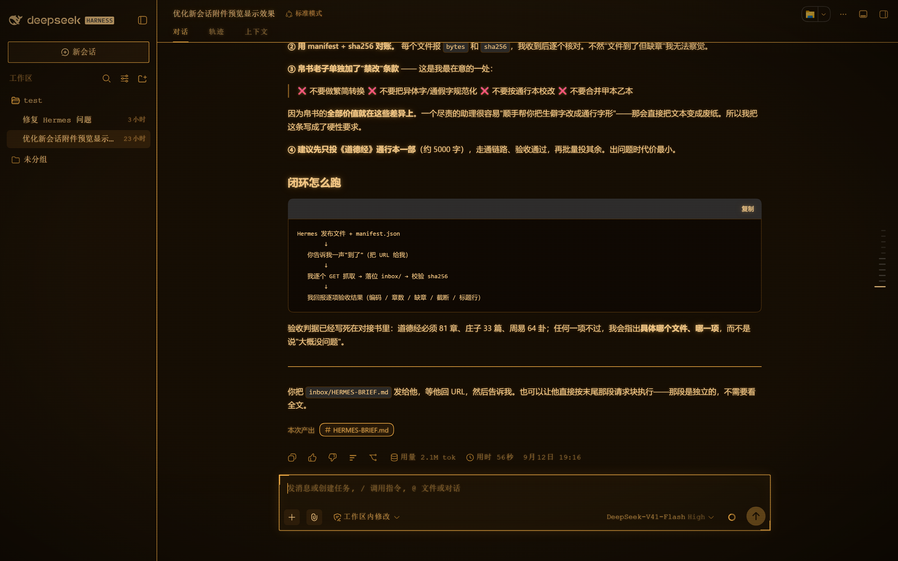

# dsh-crt-skins

Two retro terminal skins for the [DeepSeek Harness](https://github.com/deepseek-ai/deepseek-harness) Web UI.
Same bones, two different screens: both pin the DSH design tokens so no DeepSeek
blue leaks through, square off the pill shapes, bracket the panels and add
synthesized terminal audio cues. One is amber phosphor, one is Pip-Boy green.

| Skin | Screen | Treatment |
|---|---|---|
| [`dsh-crt-terminal`](./packages/skins/crt-terminal) | amber phosphor | scanlines, curved-screen vignette, slow flicker |
| [`dsh-pipboy-terminal`](./packages/skins/pipboy-terminal) | Pip-Boy green | stable glass, top sheen, hairline bezel, no animation |

<table>
<tr>
<td></td>
</tr>
<tr>
<td></td>
</tr>
</table>

## Install

Only one token theme can be active at a time — pick one.

```sh
# amber phosphor CRT
npx @deepseek-ai/dsh plugin --profile web add "file:C:/path/to/dsh-crt-skins/packages/skins/crt-terminal"

# Pip-Boy green
npx @deepseek-ai/dsh plugin --profile web add "file:C:/path/to/dsh-crt-skins/packages/skins/pipboy-terminal"
```

From GitHub, pinned to a commit, via the monorepo subpath:

```sh
npx @deepseek-ai/dsh plugin --profile web add "github:laohankk/dsh-crt-skins#<commit-sha>&path:/packages/skins/crt-terminal"
```

Both skins are also listed in the **DSH Skin Market** (Settings → Skin Market).

Restart DSH Web (`dsh web`) after installing or removing a skin.

## Verify

The repository ships a dependency-free contract test that covers every skin —
bundle path, `exports["./package.json"]`, row id/name agreement, template-literal
safety, and a real load of each bundle in a simulated DOM (style injection,
audio listeners, mute toggle, dispose):

```sh
node tools/verify.cjs
```

## Compatibility

Verified against **DSH Web `0.1.5-rc.1`** on Windows 11. Both skins are
client-only: the Node half is deliberately inert, and the stylesheet and audio
listeners are mounted as one disposable effect, so removing the plugin removes
everything again.

## License

[MIT](./LICENSE) © 2026 laohankk

`dsh-pipboy-theme` (published by `lizalise`) is credited in both skin READMEs as
the project that first mapped the DSH token surface. No code or assets from it
are redistributed here.

Pip-Boy and Fallout are trademarks of Bethesda Softworks LLC. Both skins are
unofficial fan themes.
