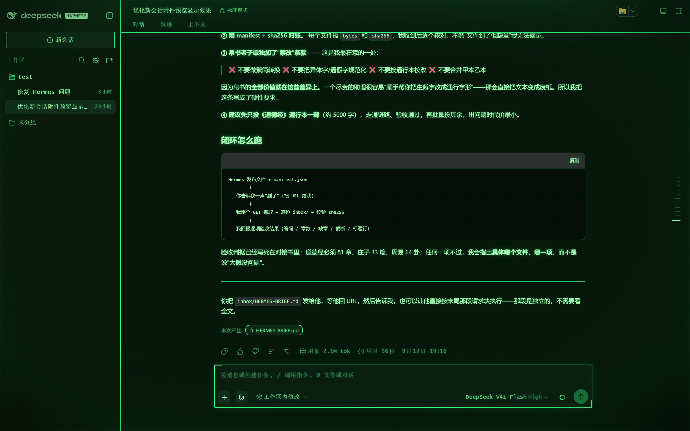

# dsh-pipboy-terminal

A **Fallout-style Pip-Boy green theme** for the DeepSeek Harness Web UI.

Classic Pip-Boy green phosphor ramp, Vault-Tec corner brackets on the panels, a glass sheen
instead of scanlines, and synthesized terminal audio cues. No assets, no fonts,
no audio files: pure CSS over the design tokens DSH already exposes, and Web
Audio for the sound.



Part of [`dsh-crt-skins`](https://github.com/laohankk/dsh-crt-skins). The sister
skin is [`dsh-crt-terminal`](../crt-terminal) — the same treatment in amber
phosphor, with scanlines, corner vignette and a slow flicker.

## Install

From the skin market: **Settings → Skin Market → search “Pip-Boy”**.

From this repository (monorepo subpath, pinned to a commit):

```sh
npx @deepseek-ai/dsh plugin --profile web add "github:laohankk/dsh-crt-skins#<commit-sha>&path:/packages/skins/pipboy-terminal"
```

Or from a local clone:

```sh
npx @deepseek-ai/dsh plugin --profile web add "file:C:/path/to/dsh-crt-skins/packages/skins/pipboy-terminal"
```

Then restart DSH Web (`dsh web`).

Remove it with:

```sh
npx @deepseek-ai/dsh plugin --profile web remove dsh-pipboy-terminal
```

## Sound

Audio cues are **on by default** and start only after your first interaction, so
nothing plays while the page loads.

| Cue | When |
|---|---|
| two-tone rising blip | a control is activated (click / tap) |
| short tick | the pointer moves onto a control, throttled to 16/s |
| noise clack + low thump | typing a character |
| deeper clack | `Enter` |
| sharper clack | `Backspace` |

The pitches sit lower than the amber CRT skin's, so the two do not sound
identical if you switch between them.

**Mute / unmute: `Alt` + `Shift` + `M`.** The choice is stored in
`localStorage["dsh-pipboy-terminal:sound"]` and survives reloads — it is
independent of the CRT skin's preference.

Programmatic control:

```js
// from the browser console
window.dshPipboyTerminal.sound.set(false)   // mute
window.dshPipboyTerminal.sound.isOn()       // read state
```

It is also exported as `exports.sound` on the client module, for other plugins.

Cues are suppressed while any modifier key is held, and key auto-repeat is
ignored, so shortcuts and held keys stay quiet.

## Conflicts

**Do not run this together with another token theme.** Themes in this family pin
design tokens with `!important`, so two of them active at once produce
last-one-wins flicker rather than a blend. Deactivate other skins — including
its green sibling `dsh-crt-terminal` — before installing this one.

## What it does

**1. Green palette.** Pins the full green ramp on `body`, including the accents
the platform otherwise routes through DeepSeek blue in dark mode
(`--dsw-static-deepseek-400/450`, `--dsw-alias-link`,
`--dsw-alias-button-info-fill`, `--dsw-alias-state-business-primary`). Without
those pins the composer send button, the sidebar folder icon and links render
blue on a green screen. **Warnings stay amber and errors stay red** — the
green screen keeps the Pip-Boy's three-state read instead of turning every
status the same colour.

**2. Phosphor bloom.** A light three-layer `text-shadow` on body copy and a
heavier one on headings and controls, so long text stays crisp instead of
turning to mush.

**3. Square corners.** DSH draws pills; this draws boxes. The composer card, the
new-session button, the hero preview badge and the composer action buttons are
squared. The send/stop disc keeps its bright fill, so its `currentColor` glyph is
forced dark for contrast.

**4. Vault-Tec frames.** The composer card, the right sidebar panel, Cordis
panels and the queue dock get a bright green rule and corner brackets. These are
keyed off stable `data-*` attributes rather than hashed CSS-module class names,
and an inset `box-shadow` draws the frame so nothing reflows.

**5. Glass, not scanlines.** Where the amber CRT skin draws scanlines and
flicker, this one draws a stable screen: a `farthest-corner` vignette (so the
corners genuinely darken), a warm top sheen and a hairline bezel around the
viewport, with no animation at all — which also means nothing to disable under
`prefers-reduced-motion`.

**6. Audio cues.** See above.

## Verified against

DSH Web `0.1.5-rc.1` on Windows 11. Compatibility outside that range is
untested.

## Attribution

Inspired by **`dsh-pipboy-theme`** (npm `dsh-pipboy-theme@1.0.0`, published by
`lizalise`, MIT) — a Fallout Pip-Boy CRT theme whose palette first showed how far
the DSH design tokens can be pushed, and whose browser bundle demonstrated the
`window.__ModuleLoader__.load` client-plugin contract.

No source file, palette value, audio asset or parameter table is copied from it:
the CSS here was written against the DSH token list; every value was
re-derived rather than copied. The audio layer is an
independent implementation of the standard Web Audio technique (enveloped
oscillators plus a band-passed noise burst).

The green reference was sampled from the Fallout 4 in-game Pip-Boy 3000
interface in its default green display setting.

**Pip-Boy and Fallout are trademarks of Bethesda Softworks LLC.** This is an
unofficial, non-commercial fan theme and is not affiliated with or endorsed by
Bethesda.

## License

[MIT](../../LICENSE)
